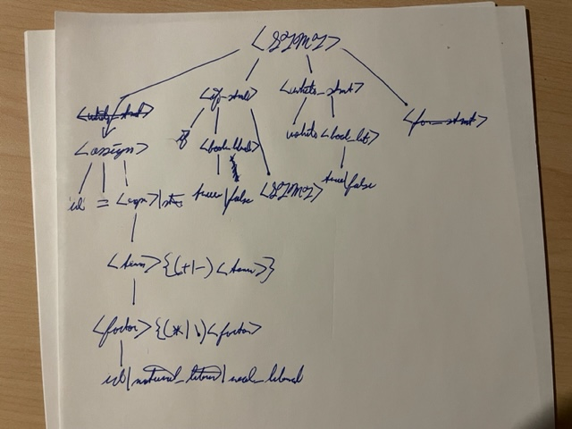
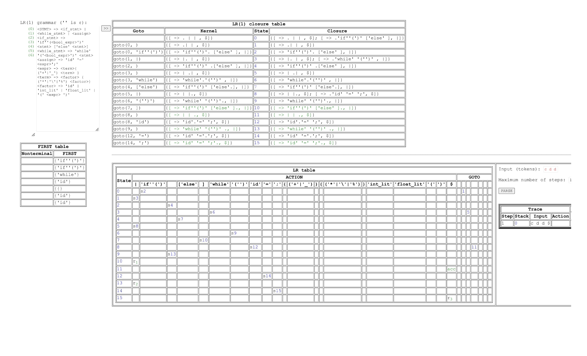

**Test 2 RESUBMIT - Programming Language Concepts**
*DUE: 04DEC22 2359EST*

The question of this assignment is 8-fold.  Answers to these 8 parts are inscribed below.
*For the sake of easy formatting, each section will be referenced in order by number (1-8) and not letter (a-h).*

1. Rules for recognizing lexemes as proper tokens.
//<STMT> --> <if_stmt> | <while_stmt> | <for_stmt> | <assign>
//<if_stmt> --> 'if''(<bool_literal>')' <stmt>'
//<log> --> <|>|<=|>=|=|!
//<bool_literal> --> ('true'|'false')
//<while_stmt> --> 'while' '('<bool_literal>')' <stmt>'
//<for_stmt> --> 
//<assign> --> 'id' '=' <expr>';' | <string>'
//<string> --> string_literal
//<expr> --> id  ('+'|'-')) id 
//<term> --> <factor> { ('*'|'\') <factor>}
//<factor> --> 'id' | 'natural_literal' | 'real_literal' | '(' <expr> ')'

2. Math Presedence: Parentheses -> Additon -> Multiplication -> Subtraction -> Division
Boolean Presedence: Parentheses -> Equal-to -> Less-than -> Greater-than

String[] badKeys was originally used to restrict "while","if","int","short","long" from being used as unique keywords.  Because there's an if statement used to limit keywords to 6-8 characters, and all restricted keys are 2-5 characters, no command is needed to prevent use of restricted keys.

3. There is no left-hand recursion, and no two rules begin the same way, so it is also pairwise disjoint.

4. Grammar is not ambiguous.  The rules cannot be represented by more than one parse tree.

5. The file TestTwo.java is a program that processes all of the lexemes in a given input file
    and produces a list of the tokens in order.

6. The latter part of TestTwo.java fulfills this requirement; it determines whether or not correct syntax was used based on grammar.

7. Four test files have been included in this project - input1.txt, input2.txt, input3.txt, input4.txt.
    Files input1.txt and input2.txt do not errors based on the language created.  The program will prompt the user
    for the name of the input file.  The file name *must* include the file extension to be accepted.  Each test file contains at least 30 lexemes and a counter is provided at the top of the output to confirm.
    
    input3.txt contains 5 errors based on the rules defined:
    * The variable declared on line 1 contains a number and too short.
    * ID on line 6 is too long.
    * Curly braces do not conform with language rules.
    * The variables on Lines 1 and 4 are not long enough.
    * An integer cannot contain letters.

    input4.txt containts 5 errors based on the rules defined:
    * The variable declared on Line 2 was assigned a value on the same line.
    * ID on line 1 is too long.
    * ID on line 3 is too long.
    * An integer variable cannot contain letters.
    * An id cannot be included in a term.

8. LR parse table - ATTACHMENT
